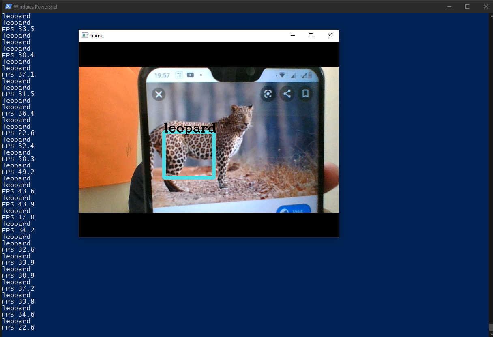

# Leopard Detection
Leopard detection is done through Custom Object Detection using YOLO. Darkflow simplifies the use of YOLO and makes custom object detection simple and easier. Step-by-step how to use Darkflow can be found here [here](https://github.com/Boltuzamaki/Custom-Object-Detection-Using-Darkflow-Simplified-).

## The Motivation
IIITDM Jabalpur campus is located right beside Dumna Nature Reserve. Dumna Nature Reserve is home to many faunae. Out of all of the faunae, Leopards and Deer have frequented the campus by jumping over the boundary walls. These Leopards pose a threat to the other residents of the lush green campus.

To make an IoT device that would alert authorities and people nearby about the prresence of a leopard, Custom Object Detection is used.

## How it's made
Real-time Custom Object Detection has been a major feild of research in Image Processing. There are pre-trained models of objects available, but there is none for a leopard. Using [Darkflow](https://github.com/Boltuzamaki/Custom-Object-Detection-Using-Darkflow-Simplified-), a model can be trained. The images used for training the model can be found [here](https://drive.google.com/drive/folders/1TW-NCSWeA0AeNuQIe5rJx3UKM4BH34NW?usp=sharing). The xml files of the images are available [here](https://github.com/arnav-deep/leopard-detection/tree/master/xml). The trained ckpt files have also been made available [here](https://drive.google.com/drive/folders/10lA2jEGqqB4TFwZQj3NURakUM7ZLW5qm?usp=sharing).

By running the [test_live_cam.py](https://github.com/arnav-deep/leopard-detection/blob/master/test_live_cam.py) file, the command prompt will show the results.

  

 

The proper steps are mentioned [here](https://github.com/Boltuzamaki/Custom-Object-Detection-Using-Darkflow-Simplified-).

## Application in project
This model for leopard detection has been made for [StaySafe](https://github.com/arnav-deep/StaySafe).

## Model
The whole system is implemented on Raspberry Pi with Pi NoIR Camera and GSM Module.

## Developers
This project has been developed by [Arnav Deep](https://github.com/arnav-deep) and [Manjot Singh](https://github.com/QuipPhoenix).

## License
GNU GENERAL PUBLIC LICENSE Version 2

Arnav Deep © November 2019. All rights reserved.
